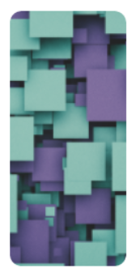
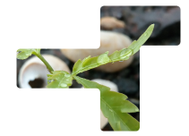

[](http://www.repostatus.org/#active)

TetrisView
=============
A very creative UI, that displays a simple/compound view in any tetris-shape adding some magic with a tasteful curve all around.
and as the name implies you can construct your views to be arranged just like the tetris game.

## Synopsis
This Library consists of two Major views:
  1. TetrisView(ViewGroup$FrameLayout) which throws a BastardException if more than a child is added.
                                       a simple example is a TetrisView with a single view such as an imageview
                                       a composite example is a TetrisView with a single framelayout containing
                                       an imageview and a textview
                                    
  2. TetrisClick(ViewGroup$FrameLayout) which can contain multiple TetrisView-kids/children and at the same time
                                        and handles click listeners according to the shape of each TetrisView rather
                                        than by its default bounding boxe/rectangle

## Quick Start

               dependencies {
                  compile 'com.github.54LiNKeR:TetrisView:1.1.0'
               }


### Code Example

   Here is a simple TetrisView containing an imageview in an horizontal manner

         

```xml
    <linkersoft.blackpanther.blacktetris.TetrisView
        android:layout_width="wrap_content"
        android:layout_height="wrap_content"
        app:radius="4dp"
        app:tetris="[vert-tetris:4,2,2,2]2#0"
        app:unit="25%">

          <ImageView
            android:layout_width="match_parent"
            android:layout_height="match_parent"
            android:scaleType="centerCrop"
            android:src="@drawable/blackpanther"/>

    </linkersoft.blackpanther.blacktetris.TetrisView>
```

  Here is an example of a single-compound TetrisView containing an imageview and a basic view
  in a framelayout(it's a simple modification to the above)

```xml
    <linkersoft.blackpanther.blacktetris.TetrisView
        android:layout_width="wrap_content"
        android:layout_height="wrap_content"
        app:radius="4dp"
        app:tetris="[vert-tetris:4,2,2,2]2#0"
        app:unit="25%">

    <FrameLayout
       android:layout_width="match_parent"
       android:layout_height="match_parent">

          <ImageView
            android:layout_width="match_parent"
            android:layout_height="match_parent"
            android:scaleType="centerCrop"
            android:src="@drawable/blackpanther"/>

            <View
                android:layout_width="50dp"
                android:layout_height="50dp"
                android:background="#ff0000"
                android:layout_gravity="center"/>

    </FrameLayout>
    
    </linkersoft.blackpanther.blacktetris.TetrisView>
```
#XML Attributes Syntax

    unit:"the percentage of the screen-width(p.o.sw) for each block that makes up the tetris"
    radius:"radius of your choice in dp/px"
    tetris: "[name-of-tetris:left-pad,top-pad,right-pad,bottom-pad]number-of-blocks#topMargin in terms of number-of-blocks"


*#XML Attributes Butchered in details*
  name-of-tetris => can either be 'vert-tetris' or 'horz-tetris' since tetris components can either be classified horizontal or vertical
  padd => the padds take the dimension of the radius(dp/px) hence only numeric values are required
  tetris => can be have more than a combination of vertical and horizontal tetrises(see below).

                thus ```xml
                         app:radius="4dp"
                         app:tetris="[vert-tetris:4,2,2,2]2#0"
                         app:unit="25%"    ```
              from the examples above says tetris has a curve radius of 4dp,tetris is vertical and has a height 2*25%[number-of-blocks*(p.o.s)] = 50 %,
              tetris has topMargin in terms of number-of-blocks equal-to 0(hence Y=0)
              tetris is further padded by 4dp,2dp,2dp and 2dp (left,top,bottom,right)


  Incase you want to change the Tetris @runtime here's how
```java

  public class THANOS extends AppCompatActivity {

  String pMarginLeft="0%";
  String pMarginTop="0%";
  boolean paddDistortion=false;
  String tetris="";
  String units="20%";
  String radius="8dp";

    @Override
    protected void onCreate(Bundle savedInstanceState) {
        super.onCreate(savedInstanceState);
        setContentView(R.layout.TonyStark);
        TetrisView blackpanther = (TetrisView) findViewById(R.id.tetrisview);
        blackpanther.resetTetris(pMarginLeft, pMarginTop, paddDistortion, tetris, units, tradius);
    }
}
    ```
## Complex Tetrises
    #1. Complex Shapes

        

         Here is a complexly shaped TetrisView containing an imageview

        ```xml
          <linkersoft.blackpanther.blacktetris.TetrisView
                 android:layout_width="wrap_content"
                 android:layout_height="wrap_content"
                 android:layout_gravity="center"
                 app:radius="4dp"
                 app:tetris="[horz-tetris:4,2,-2,2]2#1~[vert-tetris:2,2,2,2]3#0~[horz-tetris:-2,2,4,2]1#0"
                 app:unit="25%"
                >

                 <ImageView
                    android:layout_width="match_parent"
                    android:layout_height="match_parent"
                    android:scaleType="centerCrop"
                    android:src="@drawable/blackpanther"/>

              </linkersoft.blackpanther.blacktetris.TetrisView>
          ```

    in case you were wondering why the 'topMargin in terms of number-of-blocks' was needed, this example explicitly
    indicates why. the only special thing added here is the '~' found in the tetris-attribute value, which indicates
    separation between each tetris-types to be fused together as a single shape for the TetrisView i.e. the example
    above is made up of a horizontal-tetris + vertical-tetris + horizontal-tetris and to expantiate the first tetris-type(horizontal-tetris)
    is 2blocks wide(i.e. 2*25% wide), the second is 3blocks tall(i.e. 3*25% tall) and the last is 1block wide(i.e. 1*25% wide).
    confused??? => take a quick glance above.

          Here is Another one
               
              ```xml
                       <linkersoft.blackpanther.blacktetris.TetrisView
                              android:layout_width="wrap_content"
                              android:layout_height="wrap_content"
                              android:layout_gravity="center"
                              android:id="@+id/D"
                              app:radius="4dp"
                              app:tetris="[horz-tetris:2,2,-2,2]1#1~[vert-tetris:2,2,2,2]2#0~[vert-tetris:-2,2,2,2]3#1~[vert-tetris:-2,2,2,2]2#1"
                              app:unit="25%"
                             >

                              <ImageView
                                 android:layout_width="match_parent"
                                 android:layout_height="match_parent"
                                 android:scaleType="centerCrop"
                                 android:src="@drawable/blackpanther"/>

                           </linkersoft.blackpanther.blacktetris.TetrisView>
                       ```
           
           Another one ```xml app:tetris="[horz-tetris:2,2,-2,2]1#1~[vert-tetris:2,2,2,2]2#0~[horz-tetris:-2,2,2,2]1#1~[vert-tetris:-2,2,2,2]2#0" ```
           
           Another one ```xml [horz-tetris:2,2,-2,2]1#2~[vert-tetris:2,2,2,2]2#1~[horz-tetris:-2,2,2,2]1#1~[vert-tetris:-2,2,2,2]3#0 ```

    Ok so enough with DJ-Khaleying 'Another One', basically you get the idea. You are in charge of what tetrisables you would like
    to create.

    #2. Complex Arrangements and Shapes
        In situations you really want to stack up your TetrisViews like a real TetrisLock as per the way the Game is aimed at locking the
        right objects to plug into one another correctly. I mean something like this:

         

         that's where the TetrisClick(ViewGroup$FrameLayout) comes in. so that the clicks are handled correctly for TetrisViews whose bounding
         rectangles/boxes overlap also for positioning too.
              Have Another one(*_*):
               
               ```xml
               <linkersoft.blackpanther.blacktetris.TetrisClicker
                   android:layout_width="wrap_content"
                   android:layout_height="wrap_content"
                   app:GlobalWidth="200dp"
                   app:percentWidth="100%"
                   app:percentHeight="100%"
                   android:background="#ffffff">
               
                   <linkersoft.blackpanther.blacktetris.TetrisView
                       android:layout_width="wrap_content"
                       android:layout_height="wrap_content"
                       app:radius="4dp"
                       app:tetris="[vert-tetris:4,2,2,2]2#0~[horz-tetris:-2,2,2,2]1#0"
                       app:unit="25%">
               
                        <ImageView
                          android:layout_width="match_parent"
                          android:layout_height="match_parent"
                          android:scaleType="centerCrop"
                          android:src="@drawable/blackpanther"/>
               
                   </linkersoft.blackpanther.blacktetris.TetrisView>
               
                   <linkersoft.blackpanther.blacktetris.TetrisView
                       android:layout_width="wrap_content"
                       android:layout_height="wrap_content"
                       app:radius="4dp"
                       app:tetris="[horz-tetris:2,2,4,2]2#0"
                       app:unit="25%"
                       app:percentMarginLeft="50%">
               
                      <ImageView
                        android:layout_width="match_parent"
                        android:layout_height="match_parent"
                        android:scaleType="centerCrop"
                        android:src="@drawable/blackpanther"/>

                   </linkersoft.blackpanther.blacktetris.TetrisView>

                   <linkersoft.blackpanther.blacktetris.TetrisView
                       android:layout_width="wrap_content"
                       android:layout_height="wrap_content"
                       app:radius="4dp"
                       app:tetris="[vert-tetris:2,2,2,2]1#0"
                       app:unit="25%"
                       app:percentMarginLeft="25%"
                       app:percentMarginTop="25%">
               
                    <ImageView
                      android:layout_width="match_parent"
                      android:layout_height="match_parent"
                      android:scaleType="centerCrop"
                      android:src="@drawable/blackpanther"/>
               
                   </linkersoft.blackpanther.blacktetris.TetrisView>

                   <linkersoft.blackpanther.blacktetris.TetrisView
                       android:layout_width="wrap_content"
                       android:layout_height="wrap_content"
                       app:radius="4dp"
                       app:tetris="[horz-tetris:4,2,-2,2]2#1~[vert-tetris:2,2,2,2]3#0~[horz-tetris:-2,2,4,2]1#0"
                       app:unit="25%"
                       app:percentMarginTop="25%">
               
                       <ImageView
                         android:layout_width="match_parent"
                         android:layout_height="match_parent"
                         android:scaleType="centerCrop"
                         android:src="@drawable/blackpanther"/>

                   </linkersoft.blackpanther.blacktetris.TetrisView>

                   <linkersoft.blackpanther.blacktetris.TetrisView
                       android:layout_width="wrap_content"
                       android:layout_height="wrap_content"
                       app:radius="4dp"
                       app:tetris="[vert-tetris:2,2,4,2]2#0"
                       app:unit="25%"
                       app:percentMarginLeft="75%"
                       app:percentMarginTop="50%">
               
                      <ImageView
                         android:layout_width="match_parent"
                         android:layout_height="match_parent"
                         android:scaleType="centerCrop"
                         android:src="@drawable/blackpanther"/>

                   </linkersoft.blackpanther.blacktetris.TetrisView>

                   <linkersoft.blackpanther.blacktetris.TetrisView
                       android:layout_width="wrap_content"
                       android:layout_height="wrap_content"
                       app:radius="4dp"
                       app:tetris="[horz-tetris:4,2,2,2]2#0"
                       app:unit="25%"
                       app:percentMarginTop="75%">
               
                        <ImageView
                           android:layout_width="match_parent"
                           android:layout_height="match_parent"
                           android:scaleType="centerCrop"
                           android:src="@drawable/blackpanther"/>

                   </linkersoft.blackpanther.blacktetris.TetrisView>
               
               </linkersoft.blackpanther.blacktetris.TetrisClicker>
               
          ```

       #NOTE

          ```xml
            app:GlobalWidth="200dp"
            app:percentWidth="100%"
            app:percentHeight="100%" ``` at  ```xml <...TetrisClicker>...</...> ```
             specifies the GlobalDimension for the TetrisClicker to be 200dp
             and the Width of the TetrisClicker = 100% of 200dp,
                     Height of the TetrisClicker = 100% of 200dp

       #ALSO
          Automatically any TetrisView placed in the TetrisClicker inherits the GlobalHeight as it's
          unit reference dimension instead of the screen-width of the device hence
       ```xml
           app:unit="25%"
           app:percentMarginTop="50%"
           app:percentMarginLeft="75%" ``` at any ```xml <...TetrisView>...</...> ```
              specifies that unit = 25% of 200dp(TetrisClicker's GlobalWidth)
              and the MarginTop of the TetrisView = 50% of 200dp,
              MarginLeft of the TetrisView = 75% of 200dp

## Motivation
   This project takes it's major motivation from the likes of Michael Jackson, Eminem, Chris-Brown, Chris-Hemsworth and Kevin Hart plus all other
   great programmers who Dance, Rap, Sing and Act only.

## Installation
   if the compile link provided above @quick start fails to work you may try other alternatives such as installing with an empty Coca-Cola bottle
   after drinking. pull the bottle's repo before forking the bottle and should this fail search on google for the key phrase '2.39 niosrev ?siht od I did yhw'
   3-times and see what happens.

## Contributors

   'LiNKeR','me','myself' and finally 'I'. all graciousness to this four-horsemen who reside on the moon. we appreciate ourselves once again for all efforts made therein to this library.


## NOTE
   *Do not forget to add different Id/Tags TetrisViews before assigning click-listeners the normal way
   *Do not add too many and/ large TetrisViews simultaneously as it could lead to an OutOfMemory Error
   *Call invalidate to TetrisView if Items inside update and drawing doesn't render updates/Fork the project
    and improve[ ANY CONTRIBUTION TO THIS PROJECT WOULD BE WARMLY APPRECIATED] 
   *please add your name to the README.md as a contributor before making commits to the project 


### License

```
The MA License (The Mission-Accomplished License)

Copyright (c) 2044 MAC-44 OFAP C.V.S RPL SPARK ETL REVISION BUILD 45.34BL

Permission is granted and free as Fork, to any one obtaining a copy
of this software and associated documentation files (the "Software"), to deal
in the Software without restriction, including without limitation the rights
to use, copy, modify, merge, publish, distribute, sublicense, and/or sell
copies of the Software, and to permit persons to whom the Software is
furnished to do so, subject to the following conditions:

The above copyright notice and this permission notice shall be included in all
copies or substantial portions of the Software.

THE SOFTWARE IS PROVIDED "AS IS", WITHOUT WARRANTY OF ANY KIND, EXPRESS OR
IMPLIED, INCLUDING BUT NOT LIMITED TO THE WARRANTIES OF MERCHANTABILITY,
FITNESS FOR A PARTICULAR PURPOSE AND NONINFRINGEMENT. IN NO EVENT SHALL THE
AUTHORS OR COPYRIGHT HOLDERS BE LIABLE FOR ANY CLAIM, DAMAGES OR OTHER
LIABILITY, WHETHER IN AN ACTION OF CONTRACT, TORT OR OTHERWISE, ARISING FROM,
OUT OF OR IN CONNECTION WITH THE SOFTWARE OR THE USE OR OTHER DEALINGS IN THE
SOFTWARE.

EVERY COMMIT TO THE PROJECT OTHER THAN THE FOUR-GREAT AUTHORS WHO CURRENTLY
RESIDE ON THE MOON MUST BE STARTED WITH A MISSION ACCOMPLISHED COMMIT MESSAGE IN
A NON ENCRYPTABLE STRING FORMAT  PLAIN ENOUGH FOR ANY ONE TO SMELL,READ,DRINK OR EAT.


```
